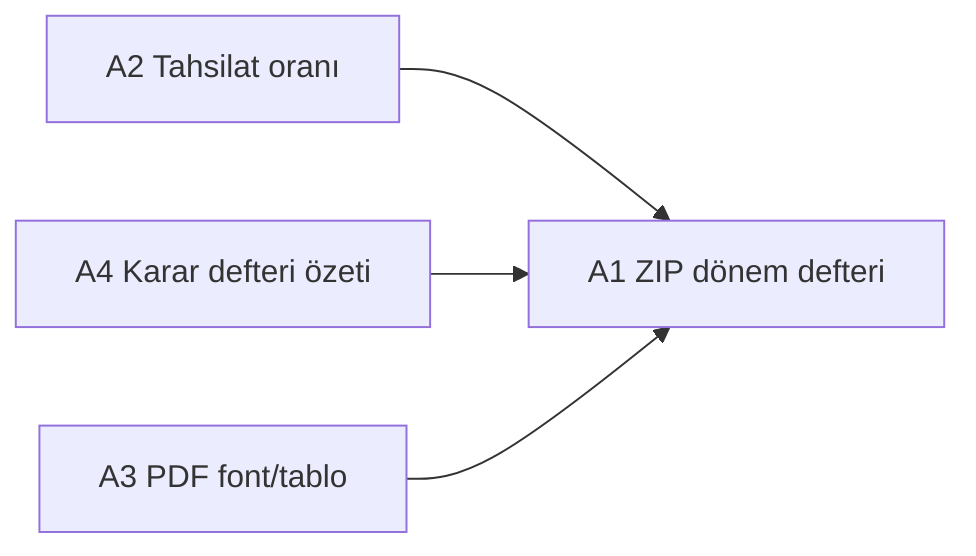

# Denetçi Raporu — FAZ A / B / C Geliştirme Planı

**Referans:** [DEVELOPMENT_RULES.md](../../DEVELOPMENT_RULES.md)  
**Bağlam:** [Yönetimcell hizalanma analizi](../) — denetçi raporu veri altyapısı mevcut; iş akışı ve paket kalitesi eksik  
**Mevcut durum:** `AUDITOR_REPORT_TEMPLATE`, `AUDIT_PACKAGE`, `ANNUAL_INCOME_EXPENSE`, `OperatingBudget`, `/auditor` portalı

---

## 1. Stratejik hedef

KMK m.41 kapsamında denetçinin ihtiyaç duyduğu **mali ve idari veriyi** sistemden tek pakette almasını sağlamak; uzun vadede denetçi görüşünün **sistem içinde kaydedilip arşivlenmesini** mümkün kılmak.

**Yazılımın rolü:** Denetçi raporunu otomatik “hukuken bağlayıcı” üretmek değil; **veri + taslak + iş akışı** sunmak. Görüş, ibra tavsiyesi ve imza denetçinin sorumluluğunda kalır.

**Bilinçli kapsam dışı (FAZ C sonrası / ayrı program):**

| Konu | Neden |
|------|--------|
| Noter tasdikli fiziksel defter | Hukuki/fiziksel süreç; yazılım dışı |
| E-imza / e-tebligat entegrasyonu | Regülasyon + üçüncü parti; ayrı proje |
| Tam ERP (mizan, defter-i kebir) | FAZ 1 lite defter ilkesi ([FAZ1_APARTMAN_PLAN.md](./FAZ1_APARTMAN_PLAN.md)) |

---

## 2. Mimari ilkeler (DEVELOPMENT_RULES uyumu)

| Kural | Uygulama |
|-------|----------|
| §1 Contract → Repository → Service | Tüm yeni domain bu akışta |
| §14 UI’da iş kuralı yok | Rapor hesaplama, durum geçişleri yalnızca service |
| §15 API route → service | Route’lar ince; Prisma yok |
| §4 i18n | Yalnızca `tr.json` / `en.json` |
| §7 Mock yasak | Tüm KPI ve özetler DB’den |
| §16 Redis | Rapor özet cache (yıl+property); event-driven invalidation |
| §19 Tablolar | Denetçi atama listesi server-side pagination |
| §30–31 Soft delete | Yeni tablolarda `deleted`, `deletedDate`, `deletedUserId` |
| §32 Audit | Taslak kaydet, onayla, export, atama — merkezi audit |
| §10 shadcn/ui | Denetçi görüş formu, atama drawer, durum badge |

**Modüller arası iletişim:**

```
apps/web (UI, actions)
    ↓
reporting-auditor (FAZ B — iş akışı)  ──→  reporting-standard (veri + export)
    ↓                                              ↓
platform-rbac (AUDITOR rol)              finance-dues, finance-core
    ↓                                              ↓
document-management (arşiv, FAZ B4)      reporting-core (PDF)
```

- **Cross-module repository erişimi yasak.** `reporting-standard` yalnızca `finance-dues` / `finance-core` **public service** çağırır.
- **FAZ A** mevcut modülleri genişletir; yeni domain modülü açmaz.
- **FAZ B** için yeni modül: `@siteyonetim/reporting-auditor` (atama + rapor durumu + görüş).

---

## 3. Mevcut envanter (değiştirilmeyecek temel)

| Bileşen | Konum |
|---------|--------|
| Denetçi şablonu builder | `packages/modules/reporting-standard/src/auditor-report-builder.ts` |
| Denetim paketi ZIP | `packages/modules/reporting-standard/src/audit-package.ts` |
| Yıllık gelir–gider | `ReportingService.annualIncomeExpense()` |
| İşletme projesi | `OperatingBudget` + `finance-core` |
| Denetçi portalı | `/auditor/properties/[id]/reports` |
| Async export kuyruğu | `ReportExport` + cron |

---

## FAZ A — Denetim paketini güçlendir

**Hedef:** Mevcut altyapıyı genişleterek denetçiye giden ZIP/PDF kalitesini Yönetimcell pratiğinin üzerine çıkarmak. **Yeni DB tablosu yok** (OperatingBudget hariç mevcut veri yeterli).

**Tahmini süre:** 1,5–2 hafta  
**Bağımlılık:** Yok (hemen başlanabilir)

### A1 — Dönem defterini denetim paketine ekle

| Alan | Detay |
|------|--------|
| **Modül** | `@siteyonetim/reporting-standard`, `@siteyonetim/finance-dues` |
| **Service** | `buildAuditPackageZip()` genişletilir |
| **Veri** | `DuesService.exportPeriodRegister()` (mevcut; max 5000 satır) |
| **ZIP dosyası** | `donem-defteri_{year}.xlsx` (veya PDF — Excel tercih: denetçi düzenler) |
| **Filtre** | Yıl bazlı; Aralık snapshot yerine tüm yıl aylık sheet veya tek yıllık özet — **MVP: yıl sonu ayı (12) matris export** |

**Contract değişikliği:** Yok (mevcut `exportPeriodRegister` kullanılır).

**Acceptance criteria:**

- [ ] `AUDIT_PACKAGE` indirildiğinde ZIP içinde 7 dosya (mevcut 6 + dönem defteri)
- [ ] Export audit: `reporting.exportFile` metadata `periodRegisterIncluded: true`
- [ ] Denetçi portalından indirilen paket admin ile aynı içerik

**Dosyalar:**

- `packages/modules/reporting-standard/src/audit-package.ts`
- Test: paket içeriği dosya adları (unit/integration)

---

### A2 — Tahsilat oranı KPI

| Alan | Detay |
|------|--------|
| **Modül** | `@siteyonetim/reporting-standard` |
| **Repository** | Yeni sorgu: yıl içi `posted accrual total` vs `payments allocated` (raw SQL veya Prisma aggregate; N+1 yok) |
| **DTO** | `AnnualIncomeExpenseReport` genişletme: `collectionRatePercent: string \| null`, `totalAccruedYear: string`, `totalCollectedYear: string` |
| **UI** | `ReportsPanel` özet kartları; denetçi şablonu mali özet satırı |
| **i18n** | `reports.collectionRate`, `reports.totalAccruedYear`, `reports.totalCollectedYear` |

**Service mantığı (örnek):**

```
collectionRate = totalCollectedYear / totalAccruedYear * 100  (posted lines only)
```

Sıfır tahakkuk → `null` (UI: "—").

**Acceptance criteria:**

- [ ] Yıllık gelir–gider ekranında tahsilat oranı KPI görünür
- [ ] `AUDITOR_REPORT_TEMPLATE` PDF mali özet bölümünde oran yer alır
- [ ] Blok filtresi KPI’ya yansır (mevcut `ReportFilter.blockId`)

**Dosyalar:**

- `packages/modules/reporting-standard/src/contract.ts`
- `packages/modules/reporting-standard/src/repository.ts` (veya `collection-rate-query.ts`)
- `packages/modules/reporting-standard/src/service.ts`
- `packages/modules/reporting-standard/src/auditor-report-builder.ts`
- `apps/web/src/components/reports-panel.tsx`
- `apps/web/src/messages/tr.json`, `en.json`

---

### A3 — Denetçi PDF şablon kalitesi

| Alan | Detay |
|------|--------|
| **Modül** | `@siteyonetim/reporting-core` |
| **Kapsam** | `renderAuditorTemplatePdf()` — tablo layout, Türkçe font, sayfa numarası |
| **Font** | PDFKit embed: `public/fonts/NotoSans-Regular.ttf` (veya repoda mevcut font politikası) |
| **Tablo** | `financialTable` için kolon genişliği hesabı; `\|` ayırıcı kaldırılır |
| **Geriye uyumluluk** | `AuditorReportDocument` contract değişmez |

**Acceptance criteria:**

- [ ] PDF’de Türkçe karakterler (ğ, ü, ş, ı, ö, ç) doğru
- [ ] Gelir–gider tablosu hizalı sütunlar
- [ ] Uzun kategori adları satır kırılımı ile taşmaz
- [ ] Mevcut async export akışı bozulmaz

**Dosyalar:**

- `packages/modules/reporting-core/src/render-auditor-template-pdf.ts`
- `apps/web/public/fonts/` (font dosyası + lisans notu)
- `docs/planning/REPORTING_CORE_PDF_EXCEL.md` güncelleme

---

### A4 — Karar defteri idari özeti

| Alan | Detay |
|------|--------|
| **Modül** | `@siteyonetim/document-management` (read), `@siteyonetim/reporting-standard` (compose) |
| **document-management** | Yeni service metodu: `listBoardMinutesSummary(input)` → `{ count, items: { title, createdAt }[] }` — yalnızca `BOARD_MINUTES`, yıl filtresi, pagination (max 20 özet satır) |
| **reporting-standard** | `buildAuditorReportDocument()` idari bölüm: sabit metin yerine özet listesi; evrak yoksa mevcut generic metin |
| **Cross-module** | `ReportingService` → `createDocumentService().listBoardMinutesSummary()` — repository’ye doğrudan erişim yok |

**Acceptance criteria:**

- [ ] Raporda “Karar defteri özeti” altında yıl içi `BOARD_MINUTES` evrak listesi
- [ ] Evrak yoksa: “Bu dönemde arşive yüklenmiş karar defteri özeti bulunmamaktadır.”
- [ ] Denetçi portalı read-only; aynı özet görünür

**Dosyalar:**

- `packages/modules/document-management/src/contract.ts`
- `packages/modules/document-management/src/service.ts`
- `packages/modules/document-management/src/repository.ts`
- `packages/modules/reporting-standard/src/auditor-report-builder.ts`

---

### FAZ A — Teslim sırası ve DoD



1. **A3 + A2** paralel  
2. **A4**  
3. **A1** (paket tüm yeni exportları birleştirir)

**Definition of Done (FAZ A):**

- [ ] `npm run typecheck` geçer
- [ ] Production build geçer
- [ ] Yeni i18n anahtarları TR/EN dolu
- [ ] Anlamlı audit kayıtları (export, KPI hesaplama hata yok)
- [ ] Admin + denetçi portalında manuel smoke test checklist tamam

---

## FAZ B — Denetçi iş akışı

**Hedef:** Denetçinin atandığı dönem için görüş girebilmesi, taslağın durum makinesi ile yönetilmesi, onaylanınca arşive kilitlenmesi.

**Tahmini süre:** 3–4 hafta  
**Bağımlılık:** FAZ A tamamlanmış olmalı (finalize PDF kalitesi)

### B0 — Yeni modül iskeleti

**Paket:** `@siteyonetim/reporting-auditor`

```
packages/modules/reporting-auditor/
  src/
    contract.ts      # DTO, input, service interface
    repository.ts    # Prisma only here
    service.ts       # iş kuralları, durum geçişleri
    index.ts
  package.json
```

**apps/web** bağımlılığı: `lib/services.ts` → `getAuditorReportService()`

---

### B1 — Veri modeli (Prisma migrate dev)

```prisma
enum AuditorReportPeriod {
  Q1 Q2 Q3 Q4 ANNUAL
}

enum AuditorReportStatus {
  DRAFT
  IN_REVIEW
  APPROVED
  ARCHIVED
}

enum AuditorDischargeRecommendation {
  RECOMMEND
  NOT_RECOMMEND
  CONDITIONAL
}

model AuditorAssignment {
  id             String   @id @default(cuid())
  organizationId String
  propertyId     String
  year           Int
  period         AuditorReportPeriod
  auditorUserId  String   // UserOrganization.userId, role AUDITOR
  assignedByUserId String
  assignedAt     DateTime @default(now())
  deleted        Boolean  @default(false)
  deletedDate    DateTime?
  deletedUserId  String?

  property Property @relation(...)
  reports  AuditorReport[]

  @@unique([propertyId, year, period, auditorUserId, deleted])
  @@index([organizationId, propertyId, year])
}

model AuditorReport {
  id               String   @id @default(cuid())
  organizationId   String
  propertyId       String
  assignmentId     String
  year             Int
  period           AuditorReportPeriod
  status           AuditorReportStatus @default(DRAFT)
  opinionHtml      String?  @db.Text   // denetçi görüşü (sanitize)
  findingsHtml     String?  @db.Text   // tespitler
  dischargeRecommendation AuditorDischargeRecommendation?
  finalizedPdfKey  String?  // object storage key (onay sonrası)
  submittedAt      DateTime?
  approvedAt       DateTime?
  approvedByUserId String?
  deleted          ...
  assignment AuditorAssignment @relation(...)
}
```

**Notlar:**

- Yıllık genel kurul → `period = ANNUAL`; 3 aylık denetim → `Q1`…`Q4`
- Soft delete zorunlu
- `finalizedPdfKey`: onay anında `reporting-standard` export buffer → `platform-files` / mevcut document storage adapter

---

### B2 — Service: atama ve yetki

**Modül:** `reporting-auditor` + `platform-rbac`

| Metod | Yetki | Kurallar |
|-------|-------|----------|
| `assignAuditor(input)` | ORG_ADMIN, PROPERTY_MANAGER | `auditorUserId` rolü AUDITOR; property scope |
| `listAssignments(input)` | Admin | Server-side pagination |
| `getAssignmentForAuditor(userId, propertyId, year, period)` | AUDITOR | Yalnızca kendi ataması |
| `revokeAssignment(id)` | Admin | Soft delete; APPROVED rapor varsa reddet |

**Audit actions:** `auditor.assign`, `auditor.revoke`

---

### B3 — Service: rapor durum makinesi

```
DRAFT ──(submit)──→ IN_REVIEW ──(approve)──→ APPROVED ──(archive)──→ ARCHIVED
         ↑              │
         └──(reopen)────┘  (yalnızca admin, audit zorunlu)
```

| Metod | Kim | Kurallar |
|-------|-----|----------|
| `createOrGetDraft(assignmentId)` | AUDITOR | Atama aktif; yıl/period eşleşmeli |
| `saveDraft(input)` | AUDITOR | status ∈ {DRAFT, IN_REVIEW}; HTML sanitize (server) |
| `submitForReview(id)` | AUDITOR | opinionHtml min uzunluk (ör. 50 char) |
| `approve(id)` | ORG_ADMIN / PROPERTY_MANAGER | PDF finalize + document create |
| `reopen(id, reason)` | Admin | APPROVED → IN_REVIEW; audit reason zorunlu |

**İş kuralı:** Onay anında `reporting-standard.exportReportFile(AUDITOR_REPORT_TEMPLATE)` çağrılır; denetçi görüşü `buildAuditorReportDocument`’e **parametre** olarak enjekte edilir (sabit metin override — FAZ B contract genişlemesi).

**Contract genişleme (`auditor-report-builder`):**

```typescript
buildAuditorReportDocument(input: {
  filter, property, annual,
  opinionOverride?: { findingsHtml, opinionHtml, dischargeRecommendation }
})
```

---

### B4 — Onay → arşiv entegrasyonu

| Adım | Modül |
|------|--------|
| PDF üret | `reporting-standard` |
| Dosya kaydet | `document-management.create()` — kategori: `BOARD_MINUTES` veya yeni `AUDITOR_REPORT` enum değeri |
| Görünürlük | `ADMIN_ONLY` + portal paylaşım opsiyonu (property setting) |
| Audit | `auditor.approve`, `document.create` |

**Prisma:** `DocumentCategory` enum’a `AUDITOR_REPORT` eklenmesi (migrate dev).

---

### B5 — UI

| Ekran | Route | Bileşen |
|-------|-------|---------|
| Denetçi atama | Admin → Raporlar veya Kullanıcılar | `AuditorAssignmentPanel` (shadcn Table + FormDrawer) |
| Rapor düzenle | `/auditor/properties/[id]/reports/audit/[assignmentId]` | `AuditorReportEditorPanel` |
| Durum görüntüle | Admin raporlar | Read-only + onay/reopen butonları |

**UI kuralları:**

- Rich text: mevcut duyuru editörü pattern’i (`announcement-rich-text-editor`) reuse — **business logic service’de**
- Mobil responsive; form drawer / sheet
- Server actions → `getAuditorReportService()` only

**i18n namespace:** `auditorReport.*` (TR/EN)

---

### FAZ B — Teslim fazları

| Sprint | İçerik |
|--------|--------|
| B-sprint-1 | B0 + B1 migrate + B2 atama API/UI |
| B-sprint-2 | B3 durum makinesi + opinion override PDF |
| B-sprint-3 | B4 arşiv + B5 denetçi editor + smoke test |

**Definition of Done (FAZ B):**

- [ ] Denetçi atanıp taslağa görüş yazabilir
- [ ] Admin onaylayınca PDF arşive düşer
- [ ] Onaylı rapor denetçi tarafından düzenlenemez (reopen hariç)
- [ ] Tüm geçişler audit log’da
- [ ] RBAC: denetçi yalnızca atandığı property

---

## FAZ C — Kanuni tamamlayıcılar (uzun vade)

**Hedef:** Banka mutabakatı, çeyreklik denetim ritmi, genel kurul kayıtları. **Ayrı program; FAZ B bitmeden başlanmaz.**

**Tahmini süre:** 6–10 hafta (paralel ekiplerle)

### C1 — Çeyreklik denetim periyodu

| Alan | Detay |
|------|--------|
| **Modül** | `reporting-auditor` (FAZ B altyapısı kullanır) |
| **UI** | Atama formunda Q1–Q4 + ANNUAL; rapor filtresi quarter |
| **Rapor** | `annualIncomeExpense` quarter slice veya yeni `quarterIncomeExpense(filter)` |
| **Hatırlatma** | `platform-jobs`: çeyrek sonu +7 gün denetçiye e-posta (outbox) |

**Bağımlılık:** FAZ B `AuditorAssignment.period` alanı

---

### C2 — Banka ekstresi import ve mutabakat raporu

| Alan | Detay |
|------|--------|
| **Yeni modül** | `@siteyonetim/finance-banking` (FAZ 2 kancası [FAZ1_APARTMAN_PLAN.md](./FAZ1_APARTMAN_PLAN.md)) |
| **MVP** | CSV/MT940 manuel import → `BankStatementLine`; kasa hareketi ile eşleştirme |
| **Rapor** | `BANK_RECONCILIATION` — `reporting-standard` kind; denetim paketine ekle |
| **Kapsam sınırı** | Otomatik banka API entegrasyonu **FAZ C2b** (ayrı) |

**C2b (2026-08-03):** Webhook tabanlı API — `POST /api/banking/webhook/[propertyId]`, `PropertyBankWebhookProfile`, JSON satır import + mevcut auto-match.

**C2b+ (2026-08-03):** Generic REST poll — `BankSyncProviderKind.GENERIC_REST_POLL`; günlük cron `GET /api/cron/bank-statement-sync` → `finance-banking.syncRestPollProfiles()`; HTTPS GET + Bearer; import kaynağı `API_REST_POLL`.

**Acceptance criteria:**

- [ ] Yönetici CSV yükler
- [ ] Eşleşmeyen satırlar listelenir
- [ ] Denetim paketinde mutabakat özeti PDF

**C2b (2026-08-03):** Webhook tabanlı banka API — `POST /api/banking/webhook/[propertyId]`; `PropertyBankWebhookProfile`; JSON satır import + mevcut auto-match.

**C2b+ (2026-08-03):** Generic REST poll — admin panelde poll URL + bearer token; cron ile günlük çekim; banka-özel adapter'lar sonraki faz.

---

### C3 — Genel kurul modülü (lite)

| Alan | Detay |
|------|--------|
| **Yeni modül** | `@siteyonetim/property-governance` |
| **Varlıklar** | `GeneralAssemblyMeeting` (tarih, tür: olağan/olağanüstü), `AssemblyDecision` (konu, sonuç), `AssemblyAttendance` (unit, katılım) |
| **Denetçi bağlantısı** | Onaylı `AuditorReport` → meeting’e `linkedReportId` |
| **Tebliğ kaydı** | `noticeSentAt`, `noticeMethod` (manuel alan; e-tebligat yok) |
| **UI** | Admin: toplantı CRUD; denetçi: read-only |

**Kapsam sınırı:** Hazirun cetveli PDF üretimi MVP; UETS entegrasyonu yok.

---

### C4 — Resmi çıktı formatları

| Alan | Detay |
|------|--------|
| **Modül** | `reporting-core` |
| **Kapsam** | Hukuk danışmanlığı ile onaylanmış antet; numaralı madde şablonu; imza blokları |
| **Noter defteri** | Yalnızca **basılı çıktıya uygun** layout; noter süreci dokümantasyon |

**Bağımlılık:** FAZ A3 PDF altyapısı + FAZ B onaylı içerik

---

### FAZ C — Öncelik sırası

```
C1 (çeyreklik) → C2 (banka MVP) → C3 (genel kurul lite) → C4 (format)
```

C2 ve C3 kısmen paralel (farklı modüller).

---

## 4. Cache ve invalidation (FAZ A–B)

| Cache key pattern | TTL | Invalidation event |
|-------------------|-----|-------------------|
| `report:annual:{orgId}:{propertyId}:{year}` | 15 dk | `dues.payment.recorded`, `ledger.entry.created`, `budget.saved` |
| `report:collection-rate:{...}` | 15 dk | aynı |
| `auditor:assignment:{propertyId}:{year}` | 5 dk | `auditor.assign`, `auditor.revoke` |

Redis merkezi client (`platform-cache`); UI cache yasak (§21).

**Durum (2026-08-03):** `report:annual:*`, `report:collection-rate:*` ve `auditor:assignment:*` cache'leri uygulandı; invalidation `finance-dues`, `finance-core` ve `reporting-auditor` mutasyonlarında tetiklenir.

---

## 5. Test stratejisi

| Faz | Test |
|-----|------|
| A | Service unit: KPI hesaplama, board minutes summary; integration: ZIP içerik |
| B | Service unit: durum geçişleri (illegal transition reject); RBAC integration |
| C | Import parser unit; governance CRUD integration |

Mock data yasak — test DB seed veya transaction rollback pattern (mevcut repo convention).

**Durum (2026-08-03):** Vitest altyapısı (`npm test`); unit testler: tahsilat oranı KPI, banka CSV parser, çeyrek hatırlatma, antet resolver, denetçi durum geçişleri, HTML sanitize.

---

## 6. Riskler ve azaltma

| Risk | Azaltma |
|------|---------|
| Denetçi HTML XSS | Server-side sanitize (allowlist tags); DOMPurify benzeri service util |
| ZIP export timeout | Mevcut async `ReportExport` kuyruğu; paket boyutu limiti dokümante |
| PDF Türkçe font lisansı | OFL font; `NOTICE` dosyası |
| KMK uyumu iddiası | UI’da “taslak / hukuki danışmanlık önerilir” disclaimer; i18n |
| Modül şişmesi | FAZ B workflow ayrı `reporting-auditor`; reporting-standard read/export |

---

## 7. Özet yol haritası

| Faz | Süre | Çıktı | Yeni modül |
|-----|------|-------|------------|
| **A** | ~2 hf | Güçlü denetim paketi + KPI + PDF + karar defteri özeti | Hayır |
| **B** | ~4 hf | Atama, görüş girip onaylama, arşiv | `reporting-auditor` |
| **C** | ~8 hf | Çeyrek, banka MVP, genel kurul lite, resmi format | `finance-banking`, `property-governance` |

**İlk uygulanabilir dikey dilim:** FAZ A1 + A2 (1 hafta) — denetim paketi ve tahsilat oranı; kullanıcıya hemen değer.

---

## 8. İlgili dosyalar (implementasyon referansı)

| Konu | Dosya |
|------|--------|
| Denetim paketi | `packages/modules/reporting-standard/src/audit-package.ts` |
| Şablon builder | `packages/modules/reporting-standard/src/auditor-report-builder.ts` |
| PDF render | `packages/modules/reporting-core/src/render-auditor-template-pdf.ts` |
| Dönem defteri export | `packages/modules/finance-dues/src/period-register-export.ts` |
| Denetçi portal | `apps/web/src/app/[locale]/auditor/` |
| İşletme projesi | `apps/web/src/components/operating-budget-panel.tsx` |
| Evrak servisi | `packages/modules/document-management/` |

---

*Son güncelleme: 2026-08-03 — DEVELOPMENT_RULES.md ile uyumlu plan taslağı.*
